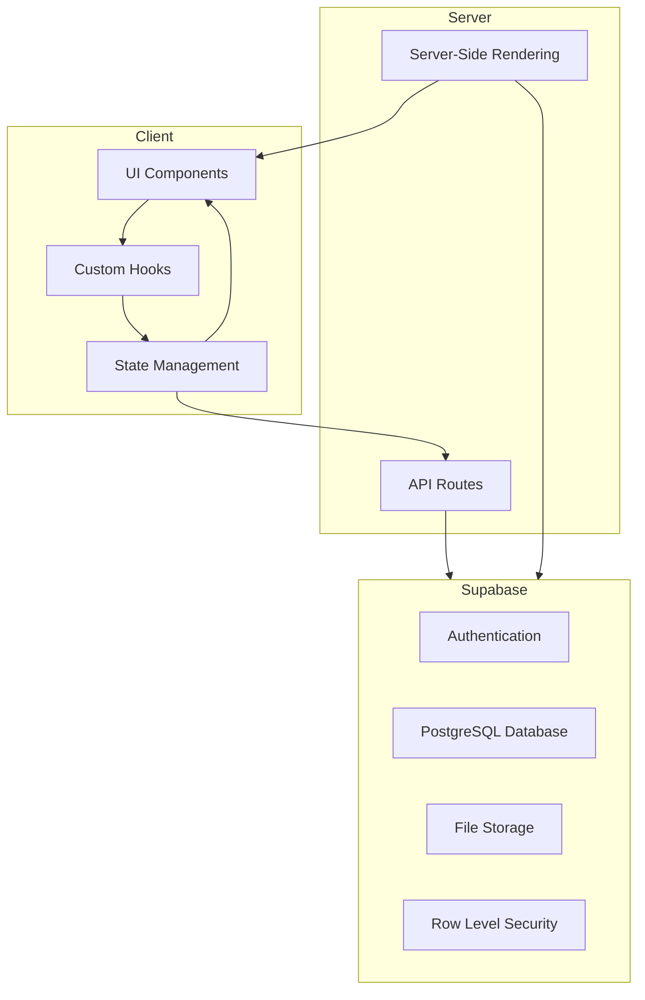
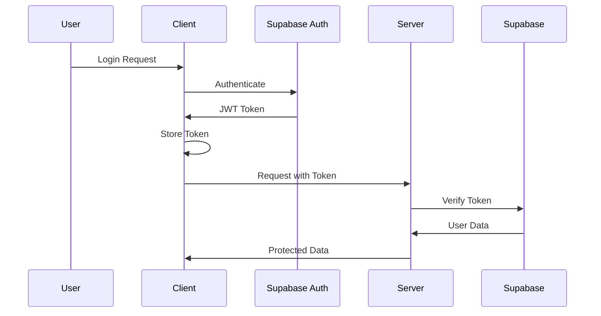

# System Patterns

## Architecture Overview

Bill Note follows a modern web application architecture with a clear separation of concerns:



## Design Patterns

### Repository Pattern

Database interactions are abstracted through repository functions that handle CRUD operations for each entity:

```typescript
// Example of the repository pattern for notes
export const notesRepository = {
  getById: async (id: string, userId: string) => {
    // Implementation
  },
  create: async (data: InsertTables<"notes">, userId: string) => {
    // Implementation
  },
  update: async (id: string, data: UpdateTables<"notes">, userId: string) => {
    // Implementation
  },
  delete: async (id: string, userId: string) => {
    // Implementation
  },
};
```

### Service Pattern

Complex business logic is encapsulated in service modules that coordinate between repositories:

```typescript
// Example of the service pattern for notes
export const notesService = {
  getNoteWithItems: async (noteId: string, userId: string) => {
    // Fetch note and related items
  },
  createNoteWithItems: async (noteData, itemsData, userId: string) => {
    // Create note and related items in transaction
  },
};
```

### Custom Hooks Pattern

React hooks encapsulate data fetching, state management, and side effects:

```typescript
// Example of a custom hook for notes
export function useNote(noteId: string) {
  const [note, setNote] = useState<NoteWithDetails | null>(null);
  const [isLoading, setIsLoading] = useState(true);
  const [error, setError] = useState<string | null>(null);

  // Implementation

  return { note, isLoading, error, updateNote, deleteNote };
}
```

### Context Providers Pattern

Global state is managed through React Context providers:

```typescript
// Example of a context provider for user state
export const UserProvider = ({ children }) => {
  const [state, dispatch] = useReducer(userReducer, initialState);

  // Implementation

  return (
    <UserContext.Provider value={{ state, dispatch }}>
      {children}
    </UserContext.Provider>
  );
};
```

## Data Flow Patterns

### Server-Side Data Fetching

For initial page loads and authenticated data access:

```typescript
// Server component example
export default async function NotesPage() {
  const supabase = await createClient();
  const { data: notes } = await supabase.from("notes").select("*");

  return <NotesComponent initialData={notes} />;
}
```

### Client-Side Data Fetching

For dynamic data loading and updates:

```typescript
// Client component with Tanstack Query
const { data, isLoading, error } = useQuery({
  queryKey: ["notes", filters],
  queryFn: () => fetchNotes(filters),
});
```

### Optimistic Updates

For responsive user interfaces:

```typescript
// Example of optimistic update pattern
const updateNote = useMutation({
  mutationFn: (updatedNote) =>
    notesRepository.update(updatedNote.id, updatedNote),
  onMutate: async (updatedNote) => {
    // Update UI immediately with optimistic data
  },
  onError: (error, variables, context) => {
    // Rollback on error
  },
});
```

## Authentication Patterns

### Authentication Flow



### Protected Routes

```typescript
// Middleware to protect routes
export async function middleware(request: NextRequest) {
  const supabase = createServerClient();
  const {
    data: { user },
  } = await supabase.auth.getUser();

  if (!user && !isPublicRoute(request.nextUrl.pathname)) {
    return NextResponse.redirect(new URL("/login", request.url));
  }

  return NextResponse.next();
}
```

## Database Access Patterns

### Row Level Security

```sql
-- Example RLS policy for notes
CREATE POLICY "Users can view their own notes or notes shared with them"
ON notes
FOR SELECT
USING (
  owner_id = auth.uid() OR
  EXISTS (
    SELECT 1 FROM note_collaborators
    WHERE note_id = notes.id AND user_id = auth.uid()
  )
);
```

### Automatic Calculations

```sql
-- Example trigger for calculating note total
CREATE FUNCTION calculate_note_total() RETURNS TRIGGER AS $$
BEGIN
  UPDATE notes
  SET total_amount = (
    SELECT SUM(total_price) FROM note_items WHERE note_id = NEW.note_id
  )
  WHERE id = NEW.note_id;
  RETURN NEW;
END;
$$ LANGUAGE plpgsql;

CREATE TRIGGER update_note_total
AFTER INSERT OR UPDATE OR DELETE ON note_items
FOR EACH ROW EXECUTE FUNCTION calculate_note_total();
```

## UI Component Patterns

### Compound Components

```tsx
// Example of compound component pattern
<DataTable>
  <DataTable.Header>
    <DataTable.Column>Title</DataTable.Column>
    <DataTable.Column>Date</DataTable.Column>
    <DataTable.Column>Amount</DataTable.Column>
  </DataTable.Header>
  <DataTable.Body>
    {notes.map((note) => (
      <DataTable.Row key={note.id}>
        <DataTable.Cell>{note.title}</DataTable.Cell>
        <DataTable.Cell>{formatDate(note.date)}</DataTable.Cell>
        <DataTable.Cell>{formatCurrency(note.total_amount)}</DataTable.Cell>
      </DataTable.Row>
    ))}
  </DataTable.Body>
</DataTable>
```

### Component Composition

```tsx
// Example of component composition pattern
<Card>
  <CardHeader>
    <CardTitle>{note.title}</CardTitle>
    <CardDescription>{note.description}</CardDescription>
  </CardHeader>
  <CardContent>
    <NoteItemsList items={note.items} />
  </CardContent>
  <CardFooter>
    <Button variant="outline">Edit</Button>
    <Button variant="destructive">Delete</Button>
  </CardFooter>
</Card>
```

## Error Handling Patterns

### API Error Handling

```typescript
// Example of API error handling pattern
try {
  const { data, error } = await supabase.from("notes").insert(noteData);

  if (error) throw error;

  return data;
} catch (error) {
  console.error("Error creating note:", error);
  throw new Error(`Failed to create note: ${error.message}`);
}
```

### UI Error Boundaries

```tsx
// Example of error boundary pattern
<ErrorBoundary fallback={({ error }) => <ErrorDisplay error={error} />}>
  <NoteDetail id={noteId} />
</ErrorBoundary>
```

## State Management Patterns

### Reducer Pattern

```typescript
// Example of reducer pattern for notes state
function noteReducer(state, action) {
  switch (action.type) {
    case "NOTES_LOADING":
      return { ...state, isLoading: true };
    case "NOTES_LOADED":
      return { ...state, notes: action.payload, isLoading: false };
    case "NOTES_ERROR":
      return { ...state, error: action.payload, isLoading: false };
    // More cases
    default:
      return state;
  }
}
```

### Query Invalidation

```typescript
// Example of query invalidation pattern
const queryClient = useQueryClient();

const createNote = useMutation({
  mutationFn: (newNote) => notesRepository.create(newNote),
  onSuccess: () => {
    // Invalidate and refetch
    queryClient.invalidateQueries({ queryKey: ["notes"] });
  },
});
```
